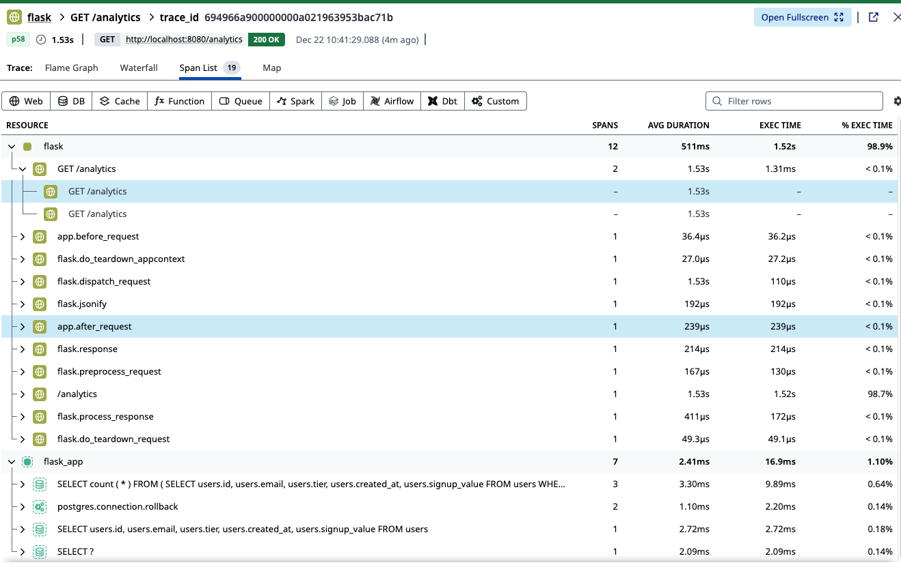
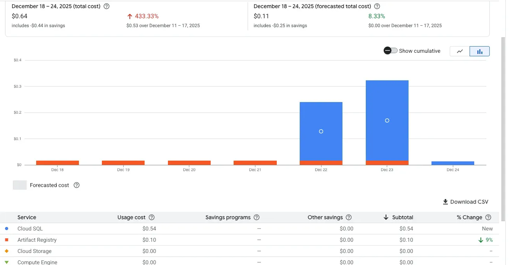

# Production-Grade Observability Stack on GCP

A comprehensive hands-on comparison of open-source (Prometheus + Grafana) vs enterprise (Datadog) observability solutions, built with Flask on Google Cloud Platform.

## 🎯 Project Overview

This project demonstrates production-grade observability by building the same monitoring stack twice—once with open-source tools and once with an enterprise platform—to understand real-world trade-offs in cost, complexity, and capabilities.

**What I Built:**
- Flask API with PostgreSQL database on GCP
- Dual observability stacks (Prometheus/Grafana + Datadog)
- Load testing infrastructure to find performance limits
- Total cost of ownership analysis based on actual usage

**Key Finding:** Engineer time dominates costs. At <20 hosts, Datadog is 32% cheaper than DIY Prometheus when factoring maintenance time ($150/hour).

---

## 🏗️ Architecture
```
┌──────────────────────────────────────────────────┐
│              Client / Load Testing               │
│                   (Locust)                       │
└────────────────────┬─────────────────────────────┘
                     │ HTTP
                     ↓
┌──────────────────────────────────────────────────┐
│         Flask Application (Port 8080)            │
│  ┌────────────────────────────────────────────┐  │
│  │  Endpoints: /, /health, /signup, /users   │  │
│  │  /analytics, /metrics                      │  │
│  └────────────────────────────────────────────┘  │
│                                                   │
│  Instrumentation:                                │
│  • Prometheus client (counters, histograms)      │
│  • Datadog APM (distributed tracing)             │
│  • SQLAlchemy (connection pooling)               │
└─────┬────────────────────────────┬───────────────┘
      │                            │
      │                            ↓
      │                 ┌────────────────────────┐
      │                 │   Cloud SQL            │
      │                 │   PostgreSQL           │
      │                 │                        │
      │                 │  • User data           │
      │                 │  • Analytics           │
      │                 └────────────────────────┘
      │
      ↓
┌─────────────────┐    ┌─────────────────┐
│  Prometheus     │    │  Datadog Agent  │
│  (Port 9090)    │    │                 │
│                 │    │  • Metrics      │
│  • Scrapes      │    │  • Logs         │
│    /metrics     │    │  • APM traces   │
│  • Stores TSDB  │    │  → Cloud SaaS   │
│  • Alerts       │    └─────────────────┘
└────────┬────────┘
         │
         ↓
┌─────────────────┐
│    Grafana      │
│  (Port 3000)    │
│                 │
│  • Dashboards   │
│  • Variables    │
│  • P95 latency  │
└─────────────────┘
```

---

## ✨ Features Implemented

### Infrastructure
- ✅ **GCP Compute Engine** - e2-micro VM ($7/month)
- ✅ **Cloud SQL PostgreSQL** - db-f1-micro ($10/month)
- ✅ **Dual monitoring stacks** - Prometheus/Grafana + Datadog

### Application
- ✅ **Flask API** - 8 endpoints with business logic
- ✅ **Database integration** - SQLAlchemy with connection pooling
- ✅ **Custom metrics** - Signup tracking, user analytics
- ✅ **Error simulation** - /slow and /error endpoints for testing

### Observability - Open Source Stack
- ✅ **Prometheus metrics** - Counters, histograms, gauges
- ✅ **Grafana dashboards** - Dynamic variables, multiple panels
- ✅ **Alert rules** - P0 (critical) and P1 (warning) severity
- ✅ **PromQL queries** - P50/P95/P99 latency percentiles

### Observability - Enterprise Stack
- ✅ **Datadog APM** - Distributed tracing with database queries
- ✅ **Infrastructure monitoring** - Auto-discovery of services
- ✅ **Log aggregation** - Centralized Flask application logs
- ✅ **Custom dashboards** - Unified metrics + logs + traces

### Testing & Analysis
- ✅ **Load testing** - Locust simulating 10-100 concurrent users
- ✅ **Performance analysis** - Found OOM limit at 25+ users
- ✅ **Cost tracking** - Actual GCP billing: $0.64 for 7 days
- ✅ **TCO comparison** - Prometheus vs Datadog at scale

---

## 📊 Key Findings

### Performance Limits (e2-micro VM)
| Users | RPS | Median Response | CPU | RAM | Status |
|-------|-----|----------------|-----|-----|--------|
| 10 | 3-4 | 26ms | 37% | ~700MB | ✅ Healthy |
| 25 | 5.6 | 1600ms | 50% | ~900MB | 🟡 Degraded |
| 100 | ~8 | 12000ms | 100% | **OOM** | 🔴 Failed |

**Bottleneck:** Memory (1GB), not CPU. Out-of-memory kills workers at 25+ users.

---

### Cost Analysis

**Actual GCP costs (Dec 18-24):** $0.64
- Cloud SQL: $0.54
- Compute Engine: $0.00 (free tier)

**Projected monthly (24/7 operation):** ~$19-25

**Observability TCO Comparison (Annual, 10 hosts):**

| Stack | Software | Setup | Maintenance | Total Year 1 |
|-------|----------|-------|-------------|--------------|
| **Prometheus + Grafana** | $0 | $1,200 | $10,800 | **$12,000** |
| **Datadog** | $3,720 | $150 | $3,600 | **$7,470** |

**Winner at small scale:** Datadog saves $4,530/year (38% cheaper)

**Break-even point:** ~20 hosts

See [detailed cost comparison](docs/prometheus-vs-datadog-comparison.md) for full analysis.

---

## 🎓 Key Learnings

### 1. Metrics vs Traces
- **Metrics** (Prometheus): "P95 latency is 2 seconds" → Tells you WHAT
- **Traces** (Datadog APM): "Database query took 1.8s of that" → Tells you WHY

### 2. Memory > CPU for Small VMs
- CPU usage was only 37% at 10 users
- But RAM exhaustion killed the app at 25 users
- **Lesson:** Size VMs by RAM requirements, not just CPU

### 3. Engineer Time Dominates Costs
- "Free" Prometheus costs $900/month in maintenance time
- Datadog's $31/host license is offset by 66% less maintenance
- **Lesson:** Evaluate total cost of ownership, not just sticker price

### 4. Load Testing Reveals Limits
- Discovered OOM issue in testing, not production
- Found exact breaking point (10-25 user range)
- **Lesson:** Always load test before launch

### 5. Observability Has Overhead
- Prometheus + Datadog consumed 250MB RAM (25% of total)
- On production systems, budget 15-20% for monitoring
- **Lesson:** Factor observability into capacity planning

---

## 📁 Project Structure
```
gcp-observability-stack/
├── README.md                                # This file
├── .gitignore                               # Excludes venv, logs, secrets
│
├── docs/
│   ├── prometheus-vs-datadog-comparison.md  # Comprehensive comparison
│   ├── day6-cloud-sql-tracing.md           # Database integration
│   └── day7-load-testing-cost-analysis.md  # Performance & cost analysis
│
├── flask-app/
│   ├── app.py                              # Flask app with full instrumentation
│   ├── requirements.txt                    # Python dependencies
│   └── locustfile.py                       # Load testing script
│
├── prometheus/
│   ├── prometheus.yml                      # Scrape configuration
│   └── alert_rules.yml                     # P0/P1 alert definitions
│
├── datadog/
│   └── conf.yaml                           # Log collection config
│
├── grafana/
│   └── [dashboards exported as JSON]
│
└── screenshots/
    ├── datadog-apm-trace.png              # Distributed tracing example
    ├── grafana-dashboard.png               # P95 latency dashboard
    ├── locust-results.png                  # Load test at 100 users
    └── gcp-billing.png                     # Actual cost breakdown
```

---

## 🚀 Quick Start

### Prerequisites
- GCP account with billing enabled
- `gcloud` CLI installed and configured
- Python 3.8+

### Deploy Infrastructure

**1. Create VM:**
```bash
gcloud compute instances create flask-api-vm \
  --machine-type=e2-micro \
  --zone=us-central1-a \
  --image-family=ubuntu-2204-lts \
  --image-project=ubuntu-os-cloud \
  --boot-disk-size=10GB
```

**2. Create Cloud SQL database:**
```bash
gcloud sql instances create flask-postgres \
  --database-version=POSTGRES_15 \
  --tier=db-f1-micro \
  --region=us-central1
```

**3. SSH into VM and clone repo:**
```bash
gcloud compute ssh flask-api-vm --zone=us-central1-a

git clone https://github.com/YOUR_USERNAME/gcp-observability-stack.git
cd gcp-observability-stack/flask-app
```

**4. Install dependencies:**
```bash
python3 -m venv venv
source venv/bin/activate
pip install -r requirements.txt
```

**5. Start Flask app:**
```bash
gunicorn --bind 0.0.0.0:8080 --workers 5 app:app
```

---

## 📸 Screenshots

### Datadog Distributed Tracing

*Full request trace showing Flask → PostgreSQL. Total time 1.53s, database queries only 16.9ms - most time spent in application logic.*

### Grafana Dashboard

*Custom dashboard with dynamic endpoint variables showing request rate, P99 latency, and error rates.*

### Load Testing Results

*Load test demonstrating e2-micro limits: 100 concurrent users caused out-of-memory failure.*

### GCP Costs

*Actual costs for 7-day project: $0.64 total, mostly Cloud SQL ($0.54). Compute Engine covered by free tier.*

---

## 🎯 Technical Concepts Demonstrated

### Metrics Types
- **Counter:** Monotonically increasing values (e.g., total HTTP requests)
- **Gauge:** Point-in-time values (e.g., active connections, memory usage)
- **Histogram:** Distribution tracking (e.g., request latency buckets for percentiles)

### PromQL Examples
```promql
# Request rate per second
rate(flask_request_count_total[1m])

# P95 latency (95% of requests faster than this)
histogram_quantile(0.95, 
  sum by (le) (rate(flask_request_latency_seconds_bucket[1m]))
)

# Error rate (5xx server errors)
rate(flask_request_count_total{status=~"5.."}[1m])

# Per-endpoint P95 latency
histogram_quantile(0.95, 
  sum by (le, endpoint) (rate(flask_request_latency_seconds_bucket[1m]))
)
```

### Alert Design Philosophy
- **`for: 2m` duration** - Prevents alert fatigue from transient spikes
- **P0 (critical)** - Service down, >5% error rate → Page on-call engineer
- **P1 (warning)** - High latency, 1-5% errors → Slack notification
- **Severity-based routing** - Different channels for different urgency levels

---

## 🤔 Decision Framework: When to Use Which Stack?

### Choose Prometheus When:
- ✅ You have 50+ hosts (cost scales linearly with Datadog)
- ✅ Data must stay on-premise (HIPAA, SOC2, compliance)
- ✅ You have dedicated SRE team to maintain it
- ✅ Cost control is critical priority
- ✅ Need deep customization of metrics collection

### Choose Datadog When:
- ✅ You have <20 hosts (cheaper than DIY when factoring engineer time)
- ✅ Team focuses on product, not infrastructure
- ✅ You need unified metrics + logs + traces (no separate tools)
- ✅ Fast time-to-value is priority (5 min vs 4 hour setup)
- ✅ Want ML-powered anomaly detection and advanced features

---

## 🔗 Resources

**Documentation:**
- [Full Prometheus vs Datadog Comparison](docs/prometheus-vs-datadog-comparison.md)
- [Cloud SQL Integration Guide](docs/day6-cloud-sql-tracing.md)
- [Load Testing & Cost Analysis](docs/day7-load-testing-cost-analysis.md)

**External Resources:**
- [Prometheus Documentation](https://prometheus.io/docs/)
- [Grafana Dashboards](https://grafana.com/grafana/dashboards/)
- [Datadog APM Guide](https://docs.datadoghq.com/tracing/)
- [PromQL Tutorial](https://prometheus.io/docs/prometheus/latest/querying/basics/)
- [DORA Metrics](https://cloud.google.com/blog/products/devops-sre/using-the-four-keys-to-measure-your-devops-performance)

---

## 💡 Use This Project For

**Learning:**
- Understand observability trade-offs (cost vs capabilities)
- Learn Prometheus, Grafana, and Datadog hands-on
- Practice infrastructure cost analysis
- Experience production monitoring setup

**Job Interviews:**
- Demonstrate end-to-end technical project
- Show cost-conscious engineering decisions
- Prove ability to evaluate and compare tools
- Portfolio piece for DevOps/SRE/Platform roles

**Production Planning:**
- Reference architecture for observability stack
- Real cost data for budgeting
- Performance benchmarks for capacity planning
- Decision framework for tool selection

